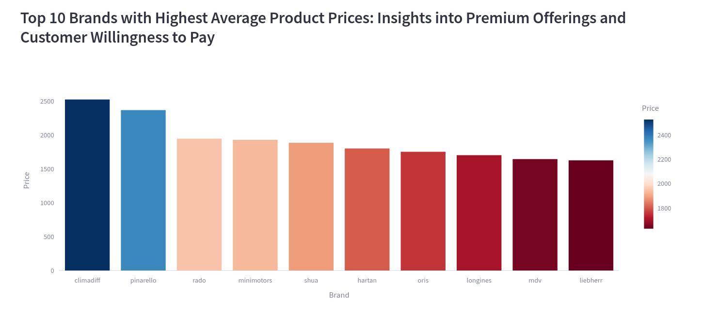
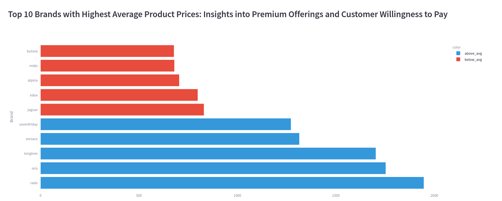
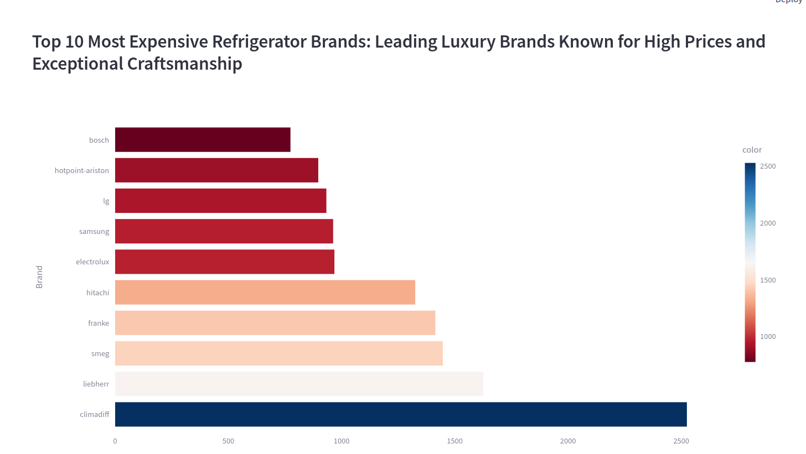
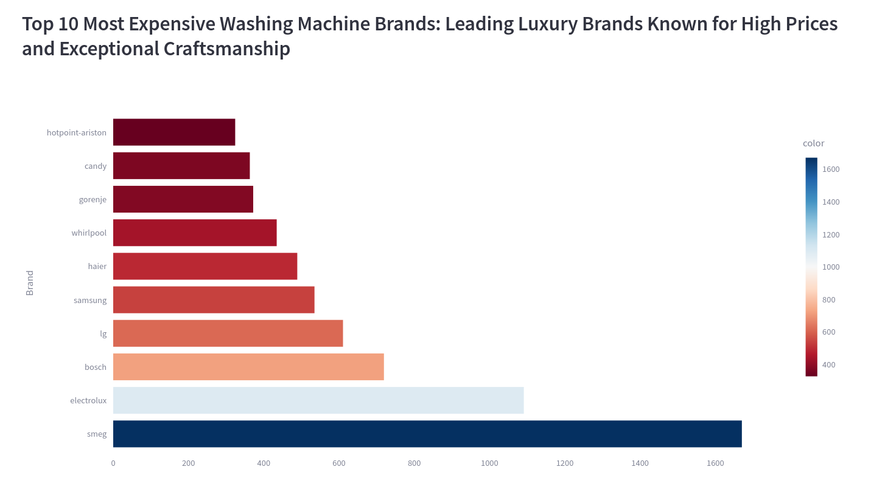
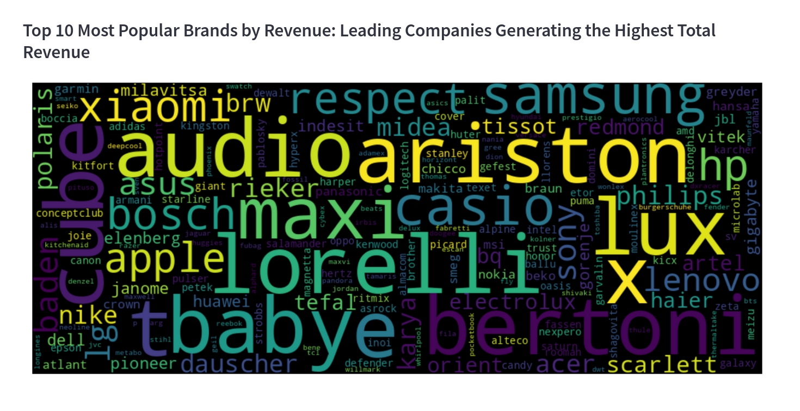

# Findings For Prices And Brands

??? info "Insight"

    Our data reveals that Pinarello products have the highest average price point, reaching 2574 dollars. This suggests that customers are willing to invest in high-end products, presenting an opportunity for store owners to offer premium items and maximize revenue.

    

??? info "Insight"
    The top 10 most expensive watch brands in our store reveal a luxury landscape. With an average price of around  1300 dollars, Rado leads the pack with an average price of 1882 dollars, followed closely by Oris and Longines. These high-end brands attract customers willing to invest in premium timepieces, offering store owners opportunities for high-margin sales.
    
    

??? info "Insight"
    The top 10 most expensive refrigerator brands in our store showcase premium appliances. Kuppersbusch leads with an average price of 1917 dollars, followed by Bompani and Smeg. These high-end brands cater to customers seeking advanced features and quality, offering store owners opportunities for high-ticket sales and profit margins.

       

??? info "Insight"
    The top 10 most expensive washing machine brands in our store reveal a premium market. Siemens leads with an average price of 2069 dollars, followed by Smeg and Electrolux. These high-end brands offer advanced features and quality, appealing to customers willing to invest in premium laundry solutions.

       

??? info "Insight"
    The dominant presence of Bertoni, Cube, Ariston, and Audio in the word cloud suggests these brands are driving sales and customer engagement. Store owners should prioritize inventory management and marketing efforts for these brands. Conversely, smaller brands like Concept Club, JVC, Denzel, and Candy may require reevaluation or targeted promotions.

       

??? Bug

    The absence of zero-priced products in our dataset suggests that the companies don't offer free products, promotional pricing, or bundling services. This indicates a focus on premium pricing, where products are valued for their quality, and the company may not rely on price promotions as a marketing strategy.

