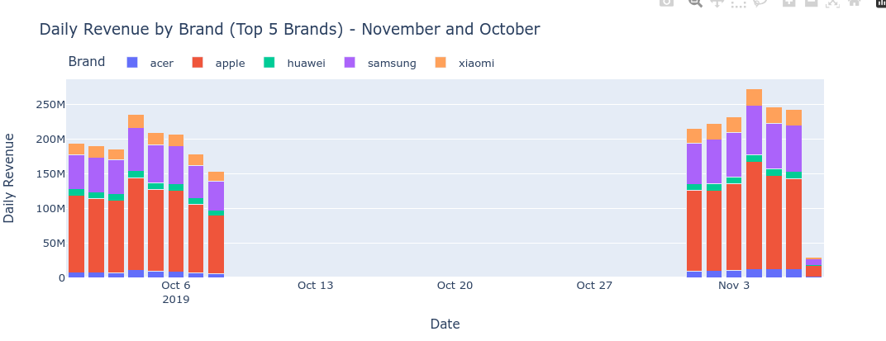
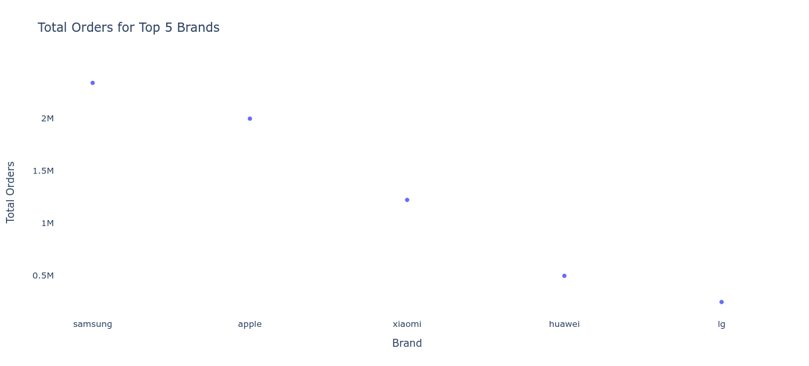

# Findings For Brand Analysis With Time Series Factors 

??? info "Insight"
    In October and November, Apple dominated daily revenue, while Acer and Huawei had relatively small shares. Samsung performed well, but Xiaomi underperformed despite its popularity. This suggests that Xiaomi's popularity may not be translating to sales.

   

??? info "Insight"
    Choad's retention rate of 0.25 is the highest, indicating strong customer loyalty. However, Juna and Vorex also demonstrate a notable retention rate of 0.2, suggesting they have a loyal customer base as well

   

??? info "Insight"
    Samsung's significantly high order volume (>2M) indicates strong market demand and customer preference. Apple's close second (>1.9M) suggests they are also popular choices.
    
   
    
    

