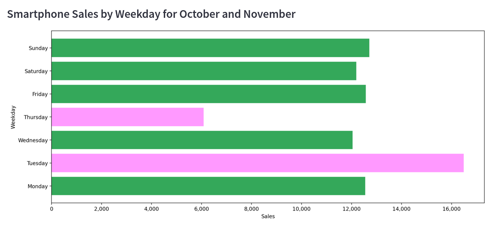

# Findings For Items Requested By Stakeholders

??? info "Insight"
    The data confirms that Samsung, Apple, Vivo, and Huawei are among the most popular smartphone brands, likely due to their strong market presence, marketing efforts, and product offerings. In contrast, Asus and Haier appear to be less popular.
    
  

??? info "Insight"
    The data suggests that Samsung, Apple, Tissot, and Casio are well-established and popular clock brands, likely due to their strong brand recognition, quality products, and effective marketing. In contrast, Calvin Klein, Rado, and Motorola appear to be less popular in terms of sales.

  

??? info "Insight"
    Bosch, Samsung, Indesit, LG, and Haier are the leading brands in washing machines, indicating strong market presence and customer preference. In contrast, Whirlpool's relatively lower sales suggest that the brand may be struggling to compete with the dominant players, potentially due to factors such as pricing, product features, or marketing strategies.

  

??? info "Insight"
    Clock sales follow a weekly pattern, with Tuesday being the peak day with 1750 sales, and Thursday being the slowest day with approximately 750 sales. 

  

??? info "Insight"
    Smartphone sales follow a weekly pattern, with Tuesday being the peak day with approximately 16,000 sales, and Thursday being the slowest day with around 6,000 sales.

  

??? info "Insight"
    Washer sales follow a weekly pattern, with Tuesday being the peak day with approximately 1100 sales, and Thursday being the slowest day with around 400 sales. 
    
  

