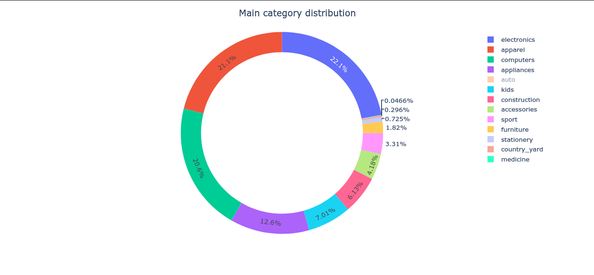
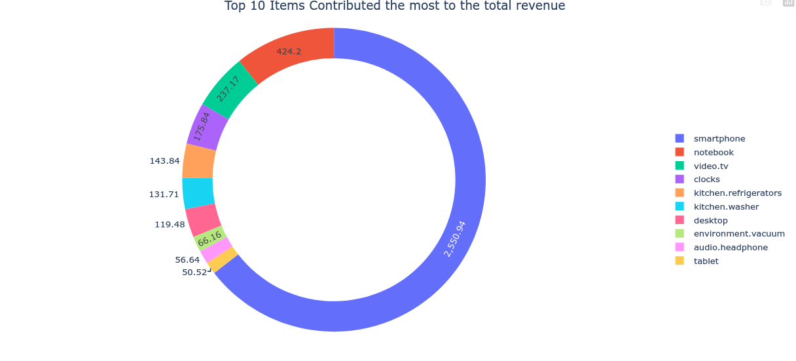
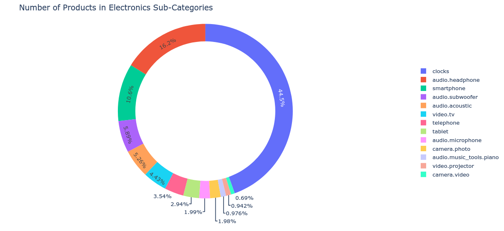
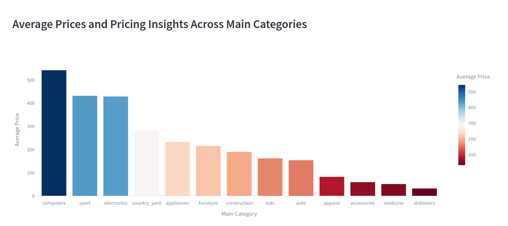
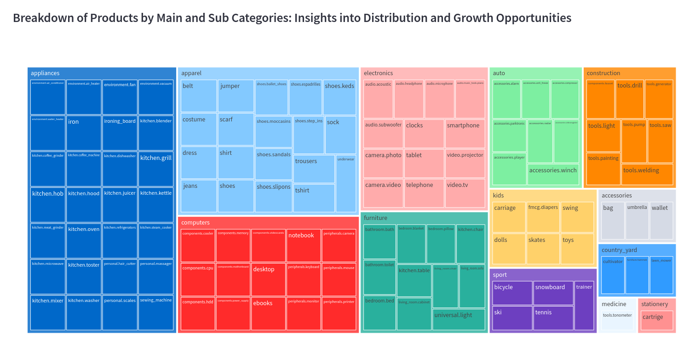

# Findings For Categories And Items

??? info "Insight"
    Our sales data reveals that Electronics and Appliances dominate the market, accounting for the largest share. In contrast, Medicine lags behind, representing the smallest category. 

    

??? info "Insight"
    Revenue analysis shows that Electronics generates the highest revenue, reaching 3,124 million. On the other end, Furniture has the lowest revenue. This disparity highlights Electronics as a cash cow, while Furniture presents an opportunity for growth and optimization to increase its revenue contribution.

    

??? info "Insight"
    A breakdown of revenue by product reveals that Smartphones are the top contributors, driving the highest revenue. In contrast, Tablets have contributed the least to revenue out of the top 10. This suggests that our Smartphone offerings are resonating with customers, while Tablets may require re-evaluation or innovation to boost sales.

       

??? info "Insight"
    Within the Electronics category, a notable trend emerges. Video Cameras have a relatively low average price point of 0.69, while Clocks have a significantly higher average price of 4.45. This price disparity may indicate opportunities for upselling or bundling strategies to increase average order value.

         

??? info "Insight"
    An analysis of average prices across categories reveals a significant gap. Computers have a substantial average price of 547 dollars, while Stationery items are priced at a modest 30 dollars on average. This price disparity highlights the premium nature of Computers and the affordability of Stationery products.

         

??? info "Insight"

    The tree map provides a breakdown of products across categories. Zoom in to explore the visualization and gain insight into the product catalog composition. Identify areas of interest, uncover patterns or trends, and develop a nuanced understanding of the product landscape by drilling down into specific categories.

         

