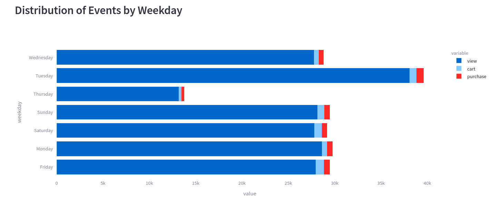
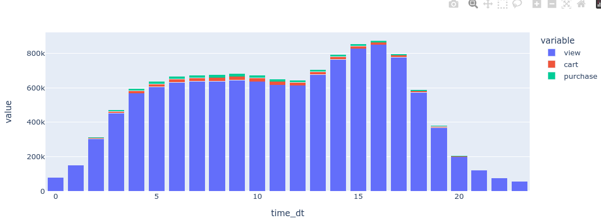
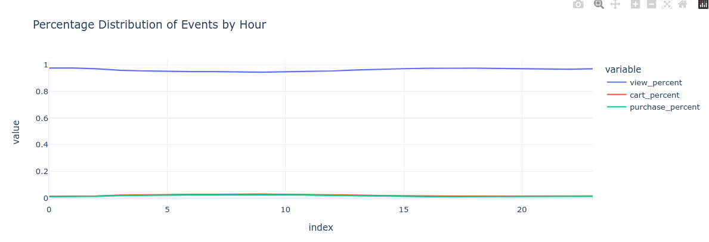
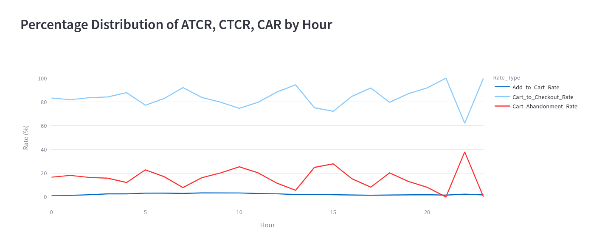
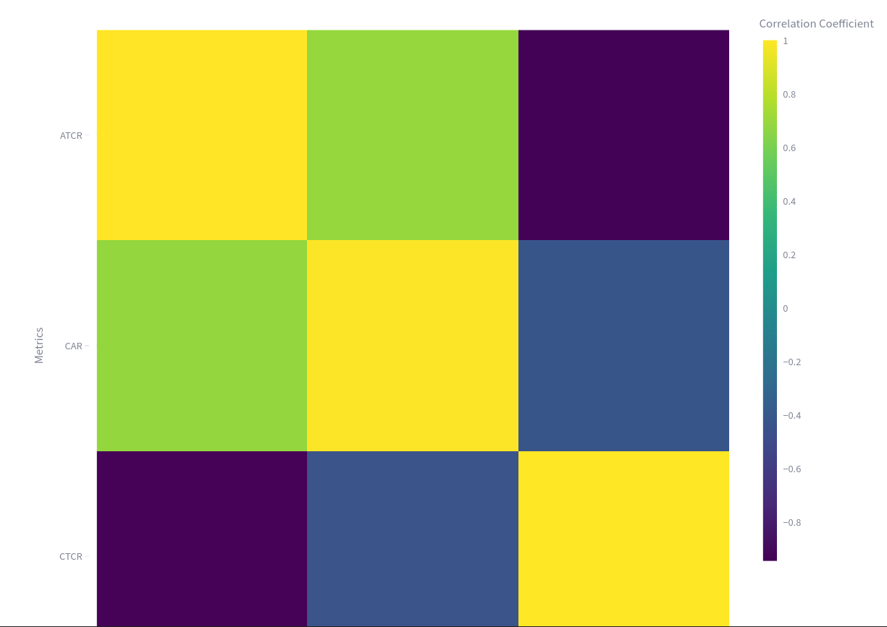

# Findings For Time Distribution Analysis

??? info "Insight"
    Our data reveals that Tuesday is the busiest day, with 2.38 million "View Cart" actions and 45,688 purchases, respectively. This suggests that customers are more likely to engage with our website and make purchases on Tuesdays, making it a key day for marketing and promotional efforts.

    

??? info "Insight"
    Our hourly data reveals that customers are most active during the following time windows:

    1. 16:00-17:00: Peak in views (850,156) and carts (14,056), with purchases (10,570) remaining strong.

    2. 15:00-16:00: High activity in views (828,353) and carts (15,168), with purchases (11,288) significant.

    3. 14:00-15:00: Continued high activity in views (764,775) and carts (15,629), with purchases (11,837) still notable.

    4. 7:00-8:00: High activity in views (638,503) and carts (19,415), with purchases (16,216) strong.

    

??? info "Insight"
    Our store's event data reveals a significant imbalance: views dominate, while cart and purchase events are scarce. This suggests that our products are attracting interest, but we're struggling to convert browsers into buyers. We need to investigate and address potential barriers to purchase, such as pricing, product information, or checkout friction.
    
  

??? info "Insight"
    
    1. CTCR (Cart-to-Checkout Rate) peaks during 17:00-20:00, suggesting customers are more likely to complete checkout during early evening hours.

    2. CAR (Cart Abandonment Rate) peaks after 20:00, indicating a higher likelihood of cart abandonment later in the evening.

    3. ATCR (Add-to-Cart Rate) remains steady, indicating consistent product interest throughout the day.

  

??? info "Insight"
    The correlation matrix reveals expected relationships between the metrics. Notably, ATCR (Add-to-Cart Rate) is highly correlated with CTCR (Cart-to-Checkout Rate), indicating that when customers add items to their cart, they are more likely to proceed to checkout. Conversely, ATCR is negatively correlated with CAR (Cart Abandonment Rate), suggesting that when customers add items to their cart, they are less likely to abandon their cart.

    These relationships are pretty much self-explanatory, as they align with the logical flow of a customer's shopping journey. When customers add items to their cart, it's a positive indicator of their intent to purchase, which is reflected in the high correlation with CTCR. On the other hand, adding items to the cart reduces the likelihood of cart abandonment, hence the negative correlation with CAR.

    Note: The correlation matrix graph is also self-explanatory, with clear and intuitive visualizations that effectively communicate the relationships between the metrics.

  

